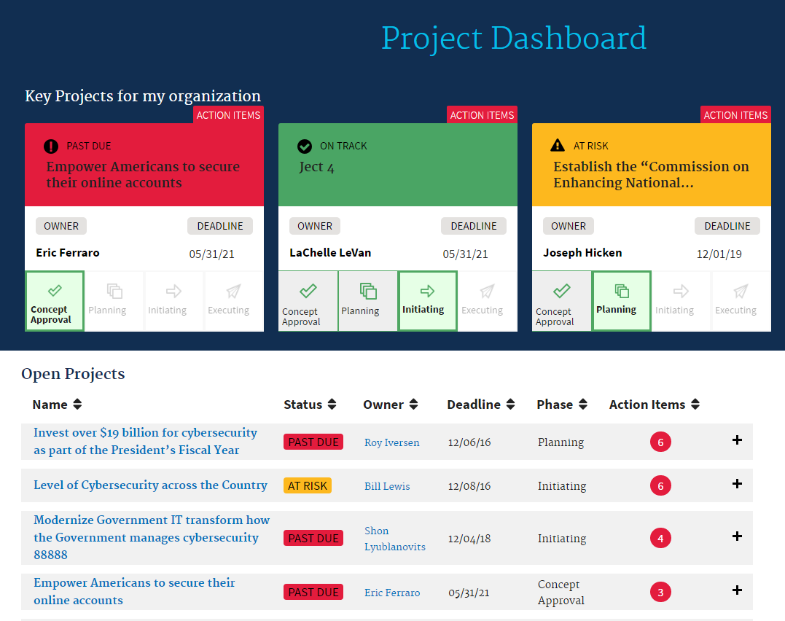

<!-- TOC depthFrom:1 depthTo:6 withLinks:1 updateOnSave:1 orderedList:0 -->

- [BACKGROUND](#background)
	- [Project Success Criteria](#project-success-criteria)
	- [Entity Relationship Diagram](#entity-relationship-diagram)
	- [High Level System Process Flow](#high-level-system-process-flow)
- [Functionality](#functionality)
	- [Process Automation](#process-automation)
	- [Application and User Interface Design](#application-and-user-interface-design)
	- [Configuration Details](#configuration-details)
		- [App Setup](#app-setup)
		- [Approval Processes](#approval-processes)
		- [Permission Set Setup](#permission-set-setup)
		- [Process Builder](#process-builder)
		- [Public Groups](#public-groups)
		- [Queues](#queues)
		- [Reports & Dashboards](#reports-dashboards)
		- [Role Hierarchy Considerations](#role-hierarchy-considerations)
		- [Sharing Rules](#sharing-rules)
		- [Tab Setup](#tab-setup)
		- [User Profile Setup](#user-profile-setup)
		- [Validation Rules](#validation-rules)
		- [Workflows](#workflows)
	- [Data Sharing Model](#data-sharing-model)
		- [Org-Wide Defaults](#org-wide-defaults)
	- [Objects](#objects)
		- [Project](#project)
			- [Fields](#fields)
			- [Custom Buttons](#custom-buttons)
		- [Project Pulse](#project-pulse)
			- [Fields](#fields)
		- [Project Lead](#project-lead)
		- [Contact](#contact)
	- [Classes, Triggers, and Other Development](#classes-triggers-and-other-development)
		- [Apex Code](#apex-code)
			- [Test Classes](#test-classes)
		- [Custom Labels](#custom-labels)
		- [Static Resources](#static-resources)
		- [Triggers](#triggers)
		- [Visualforce Pages](#visualforce-pages)

<!-- /TOC -->

# BACKGROUND

## Project Success Criteria

**What is the Problem?  Describe the specific business problem this project is intended to solve, or the business process that would be improved.**
The “team” currently tracks X number of Projects in a google spreadsheet and reporting on them to their program manager via a Powerpoint presentation. Currently, one person is in charge of gathering all of this information from the various projects, this is extremely difficult for them to accomplish and difficult to then report on to the program manager.

**What is Needed?  Describe what success looks like.  How this project will resolve the problem or improve the function?**
They are looking for a simple solution that would make it easy for them to enter the status updates, and report on them in a concise manner to the program manager. This solution will enable them to view a Project Dashboard that can be presented to the program manager. It will also allow for automated reminders to complete the Project Status updates and an easy interface for the Project Managers to make those updates.

## Entity Relationship Diagram

## High Level System Process Flow

#  Functionality

## Process Automation
N/A

## Application and User Interface Design

*Project Dashboard*

*Project Dashboard Continued*

*Project Dashboard - Project Details Page*

*Project Dashboard - Project Pulse Detail Page*

*Project Dashboard - Other Project Leads Detail Page*

## Configuration Details
### App Setup
Project Dashboard
### Approval Processes
Process  Name|Description|Object
--------------|----------|-------
ProjDash-ProjectPulseApproval|ProjDash - This approval process is submitted by the individual Project Manager to the Program Manager for approval on all project pulse records|Project Pulse
### Permission Set Setup
* ProjDash - Manager - CRED
     * Assigned to Program Manager who will have Create, Read, Edit, Delete, and View All access to Projects. Read, Edit, Delete, and View All access will be given for the Project Pulse object. Read, Create, Edit, and Delete access will be given to the EOP/Agency Leads object.
* ProjDash - Owner/Collaborator - CRED
    * Assigned to Project Managers, Owners, and Collaborators who will create, read, edit and delete Project Pulses. Read access will be given to the Project object.

### Process Builder
Process  Name|Description|Object
--------------|----------|-------
ProjDash-ProjectPulseApproval| ProjDash - This approval process is submitted by the individual Project Manager to the Program Manager for approval on all project pulse records|Project Pulse

### Public Groups
Label|Name|Use or Description
------|---|-------
ProjDash-Managers|ProjDash_Managers|This public group is for Program Managers to have CRED access over all Projects, Dashboards, Reports, and the ability to approve, read and edit all Project Pulse records
ProjDash-Owners|ProjDash_Owners|This public group is for Project Managers and Collaborators that are record owners of Projects and Project Pulse Records.

### Queues
Queue Label|Queue Name|Use or Description
--------|------|---------
ProjDash-Managers|ProjDash_Managers|This queue is used in the Project Pulse approval process. Members of this queue will be delegated as ‘Assigned Approvers’ for any submitted Project Pulse records
### Reports & Dashboards
Not Applicable    
### Role Hierarchy Considerations
Not Applicable
### Sharing Rules
Not Applicable
### Tab Setup
* Home
* Projects
* Project Pulses
* Project Dashboard
* Reports

### User Profile Setup
No new profiles will be created for this application. Access can given via permission sets
### Validation Rules
Not Applicable
### Workflows
Rule Name|Description|Object
---------|-----------|-------
ProjDash-Project-StatusUpdate|When the Status equals 'Complete', the Phase field value will update to 'Close-Out/Close'|Project

## Data Sharing Model

### Org-Wide Defaults
Object|Default Internal Access|Default External Access
------|-------|---------
Project|Public Read/Write|Public Read/Write
Project Pulse|Controlled by Parent|Controlled by Parent
Project Lead|Public Read/Write|Public Read/Write
Users who have the Read permission on the above objects will be able to view the projects, project pulses and project leads added to the project records. In addition to these objects, you must configure sharing settings for the Contact, and perhaps, the Account objects in your org.

## Objects

### Project
API Name: ProjDash_Project__c

#### Fields
Field Label|API Name|Data Type|Controlling Field|Track History
----|------|-----|----|----
Project Name|Name|Text (80)||
Accomplishments|Accomplishments__c|Rich Text Area(600)||
Action Items|Action_Items__c|Rich Text Area(600)||
Blockers|Blockers__c|Rich Text Area(600)||
Collaborator|Collaborator__c|Lookup(User)||
Deadline|Deadline__c|Date||
Description and Key Elements|Description_and_Key_Elements__c|Long Text Area(600)||
Domain|Domain__c|picklist||
Escalations|Escalations__c|Long Text Area(600||
Funding Source and Needs|Funding_Source_and_Needs__c|Long Text Area(600)||
Key Project|Key_Project__c|checkbox||
Other Stakeholders|Other_Stakeholders__c|Long Text Area(600)||
Owner Name|Owner_Name__c|Formula (Text) This formula references multiple objects||
Phase|Phase__c|picklist||
Priority|Priority__c|picklist||
Pulse Approved Date|Pulse_Approved_Date__c|Date||
Stakeholders|Stakeholders__c|Picklist (Multi-Select)||
Status|Status__c|picklist||

#### Custom Buttons

Label|Name|Type|Description
---|-----|----|-----------
Project Dashboard|ProjectDashboard|List Button|Javascript button on the Project object list view to take the user to the ProjectDashboard VF page on click

### Project Pulse
API Name: ProjDash_ProjectPulse__c

#### Fields
Field Label|API Name|Data Type|Controlling Field|Track History
----|------|-----|----|----
Project Pulse|Name|Auto Number||
Accomplishments|Accomplishments__c|Rich Text Area(600)||
Action Items|Action_Items__c|Rich Text Area(600)||
Blockers|Blockers__c|Rich Text Area(600)||
Escalations|Escalations__c|Long Text Area(300)||
Phase|Phase__c|picklist||
Project Name|Project_Name__c|Master-Detail(Project)||
Pulse Approved|Pulse_Approved__c|checkbox||

### Project Lead
API Name: ProjDash_ProjectLead__c

Field Label|API Name|Data Type|Controlling Field|Track History
----|------|-----|----|----
Contact Role|Name|Auto Number||
Project Name|Project_Name__c|Lookup(Project)||
Lead(s)|Lead_s__c|Lookup(Contact)||
Role|Role__c|picklist||

### Contact
NOTE: You may need to customize the contact object depending on your org’s sharing model as Project Lead object has a lookup relationship with Contact object

## Classes, Triggers, and Other Development
### Apex Code

Name|API Version|Status|Description|Code Coverage
---|----|----|----|----
ProjDash_Controller|37.0|Active|Controller Class for ProjectDashboard VF page|100%
ProjDash_EmailReminderScheduler|36.0|Active|Scheduler class to send email to Project owners every Monday at 9:00am(time can be configured as needed)|100%

#### Test Classes

Name|API Version|Status|Description|Code Coverage
---|----|----|----|----
ProjDash_ControllerTest|37.0|Active|Test class for apex controller ProjDash_Controller
ProjDash_EmailReminderTest|36.0|Active|Test class for ProjDash_EmailReminderScheduler|

### Custom Labels
Custom Labels are used throughout the application so that teams may utilize business-specific names as needed.

Name|Value
---|---
ProjDash_KeyProjects_Title|Key Projects for My Organization
ProjDash_NokeyProjErrorMessage|No Key Projects selected
ProjDash_PageTitle|Project Dashboard
ProjDash_Status_four|On Track
ProjDash_Status_one|At Risk
ProjDash_Status_three|Complete
ProjDash_Status_two|Past Due
ProjDash_Tracker_Phase1|Phase 1
ProjDash_Tracker_Phase2|Phase 2
ProjDash_Tracker_Phase3|Phase 3
ProjDash_Tracker_Phase4|Phase 4
ProjDash_Tracker_Phase5|Close-Out/Close

### Static Resources
* ProjectDashboardCSS
* ProjectDashboard - Static Resource for all icons

### Triggers
Not Applicable

### Visualforce Pages

Name|Description
---|----
ProjectDashboard|Visualforce Page to display the Project Dashboard
